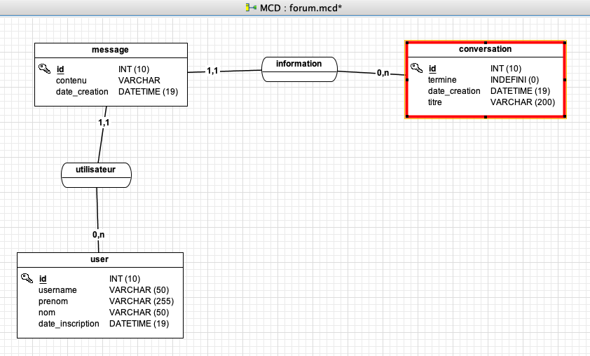
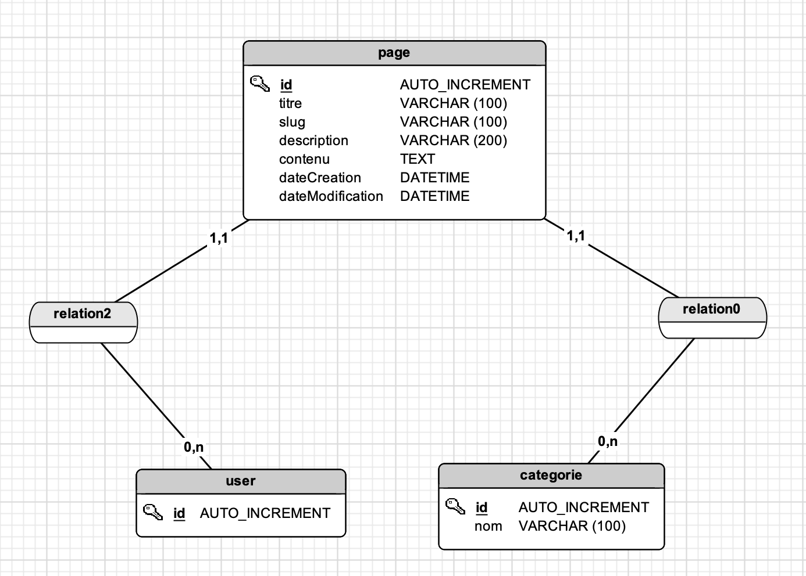

# Symfony 9 Février

## First symf
Créez une card en bootsrap avec le titre qui devra être dynamique et son contenu aussi

Vous devez pour ça créer un nouveau contrôleur qui s'appelle "Exo" avec une route qui devra s'appeler "firstExo"

## Second exo sur les formulaires
Créez un formulaire d'inscription
- nom
- prenom
- email
- login
- password

Vérifiez que le formulaire est bien envoyé et que l'email est valid, à la suite de ça, on affiche un message d'erreur correspondant ou que tout s'est bien passé

## Test des repository et des routes
Sur le contrôleur Voiture

Créez des routes qui vont utiliser chaque méthode par défaut

Dans vos vues, il faudra pouvoir voir le contenu des résultats attendus

Chaque vue doit avoir un lien vers les autres pages grâce à la fonction path() de twig

## Affichez les voitures via une url
Il faudra pouvoir afficher une voiture par un ID dans l'url ou son nom

## Les vacancessss, exo "site propre en symfony avec bootstrap" pour le retour du 27 février
Modifiez le site actuel entièrement avec bootstrap

* Ajoutez un logo au centre avec le texte Alkas 
* Un menu déroulant à gauche qui devra avoir un sous menu cours, exo et voiture. Ce dernier et ses pages devront être accessible uniquement si on est connecté en ADMIN (RTFM)
* Un menu à droite pour la connexion et déconnexion si on est déjà connecté

## Marque et chemise
Création de la relation sur la marque chemise

## Sécurité des marques et chemises
Seuls les utilisateurs qui ont créé une chemise et une marque peuvent la changer et la supprimer

## Voter sur les chemises et les marques
Sécurité améliorée par les voters et affichage sur la page d'accueil d'un message d'erreur

## Affichage restreint
Les personnes doivent pouvoir voir uniquement leurs marques et chemises

## Forum

- À partir du MCD, faire le forum

- Il faudra avoir une page qui va lister les conversations (voir la date de création, de la dernière modif et le nom du dernier utilisateur qui a ajouté un message) et sur un clique on pourra voir les messages.

- On pourra aussi retrouver la conversation via l'url, c'est-à-dire par un slug (pour créer un slug, il y a le composant Slug).

- La page message devra afficher en titre le nom de la conversation, les noms des utilisateurs, la date et l'heure et on devra pouvoir revenir sur la liste des conversations.

- Seul l'utilisateur (ou l'admin) qui a créé la conversation pourra choisir de terminer la conversation.

- Seuls les admins peuvent supprimer les conversations (donc ses messages doivent être supprimé)

- Un utilisateur pourra seulement modifier son propre message ou les admins, on pourra voir la date de modification

# Eval Conception d'un " CMS " en symfony (10 mars 2022)

## Questions

- À quoi sert Request $request ?

- Qu'est-ce qu'une hydratation ? 

- Dans une méthode, on retrouve souvent dans les paramètres des choses du genre (Request $request, Chemise $chemise), comment ça s'appelle et comment ça marche ?

- Via un contrôleur, j'aimerais afficher une chemise par son identifiant comme dans cet exemple /chemise/4, 
Comment l'écrire ?

- Qu'est-ce qu'un voter et son but ?

- Qu'est-ce qu'une entité ?

- Qu'est ce qu'un repository ?

- Pourquoi il vaut mieux utiliser des versions LTS dans la majorité des cas ?

- Comment envoyé une erreur et l'intercepté ? Expliquer la logique

- Comment basculer le site en mode développement et production 

- Comment supprimer le cache ?

---
## Exo de l'éval

- Créez un projet symfony dans votre dossier étudiant/votreprénom/evalSymfony (vous pouvez faire un copier / coller de mon projet symfony mais pas le vôtre)

- Créez une base de donnée via ce MCD :

- Chaque page a une catégorie (ex: sport, actualité, etc.) dont l'on devra sélectionner lors de la création et modification (création / modification que par un admin)

- On pourra lister les pages et on pourra les supprimers ou modifiers mais uniquement par celui qui l'a créé ou un admin

- On pourra trier les pages par leurs catégories

- Affichez une page via son slug

- La page doit afficher uniquement : le titre, la date de création, sa catégorie et date de modification ainsi que son contenu.

- Ajoutez dans la bannière la possibilité de voir les pages

- Faire une jolie mise en page

Attention cependant pour le SEO, le titre et la description doivent être aussi dans les balises faites pour ça.