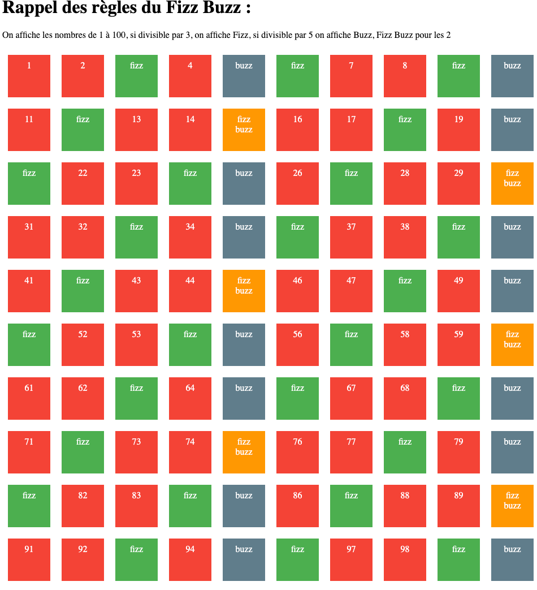

# Révision
#### Exo civilité
En fonction de ce que l'utilisateur saisi Mr, Mme, etc., il faut remplacer par Monsieur, Madame, etc.

Faire les deux cas avec des "if" et des "switch"

Evolution
On doit permettre à l'utilisateur de choisir entre un if ou un switch en tapant ces mots clés puis demander la civilité et faire le if si l'utilisateur à taper if 
si on tape n'importe quoi, il faut lui dire

### Algo FizzBuzz 
On affiche les nombres de 1 à 100, si divisible par 3, on affiche Fizz, si divisible par 5 on affiche Buzz, Fizz Buzz pour les 2

